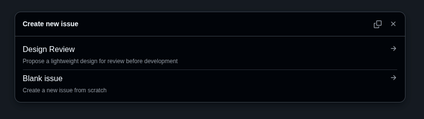

# Lightweight Design Review Guidelines (v1)

## 1. Purpose

The goal is to create a culture of **upfront lightweight design review** that:

* Encourages developers to think about architectural and future implications before committing code.
* Helps avoid significant **rework, redesign, and refactoring** later.
* Upskills junior developers in design thinking and architectural decisions.
* **Does not** slow down experimentation or become a bureaucratic burden.

⚠️ **Keep it lightweight:**
If it takes more than **20 minutes to write** and **30 minutes to review**, you’re doing it wrong.
(If serious design concerns emerge, schedule a deeper design session separately.)

---

## 2. When to Do a Design Review

Do a design review if your task meets **one or more** of the following:

✅ **New Component or Service**

* Creating a new repo or major component.
* Adding a significant new module that other parts of the system will depend on.

✅ **Architectural or Structural Change**

* Designing or significantly changing:

  * Database schema or data storage format.
  * Message/event structures or APIs (REST/GRPC/Event streams).
  * Filesystem structure used by other services.

✅ **Cross-Component Interaction**

* Introducing or modifying **integration points** (1\:N, N\:M relationships).

✅ **Introducing New Technologies or Dependencies**

* Adding a new framework, major library, or external service.

✅ **Significant Complexity or Risk**

* Work expected to take more than **\~3 days**.
* Clear **uncertainties, assumptions, or performance risks**.

### No Design Review Needed If:

* Bug fixes, small refactors, UI tweaks.
* Internal-only changes with no long-term maintainability impact.

When in doubt → **err on the side of writing one** (it’s quick).

---

## 3. Design Review Template

Keep it **½–1 page**, bullet points are fine.

### Template

1. **Title & Summary**

   * **What is being built?** (1–2 sentences)
   * **Why are we building it?** (high-level purpose / requirements)

2. **Relationships**

   * How does it relate to other components?
   * Cardinality (1:1, 1\:N, N:1, N\:M)?

3. **Primary Interfaces**

   * What interfaces will it expose? (REST, GRPC, Event, API, STDOUT, etc.)
   * Who/what will consume them?

4. **Dependencies & Technologies**

   * What does it depend on?
   * Any **new frameworks or libraries**?

5. **Technical Approach (High-Level)**

   * Tools, languages, and data flow (bullets).
   * Include a simple diagram if helpful.

6. **Assumptions, Risks & Open Questions**

   * Uncertainties (e.g., performance, upstream dependencies, security).
   * Assumptions that could break the design.

---

## 4. Review Process

### Step 1 – Write

Author drafts the design doc (≤20 min).

### Step 2 – Share

* **Initial:** Create design review github issue in repository, tag reviewers & let them know via email, Slack, Watt message.
* **Design Review Issue Creation** 
* **Final:** commit to repo (`/docs/design/`).

### Step 3 – Review

* **At least one reviewer** (preferably someone familiar with the affected codebase).
* **Two reviewers** for major components or new repos.

### Step 4 – Discuss

* Quick chat or short email thread (≤30 min).
* If big issues arise, schedule a deeper session.

### Step 5 – Record

* Once agreed, commit the doc into the repo (`docs/design/...`).

---

## 5. Reviewer Checklist

When reviewing, ask:

1. **Purpose & Scope** – Is the problem well understood? Does the design fit the requirements?
2. **Relationships** – Have cross-component impacts been considered?
3. **Interfaces** – Are the interfaces clear, minimal, and aligned with existing conventions?
4. **Dependencies** – Any unnecessary frameworks or tech bloat introduced?
5. **Future Flexibility** – Does the design allow reasonable future changes without huge refactors?
6. **Risks & Assumptions** – Are key uncertainties identified?

---

## 6. Examples

### Example 1 – Logging Service

**Title & Summary**
**"User Activity Logging Service"**
We need a lightweight logging service to track user activity (login, API calls) for analytics and auditing. Must handle \~10k events/day, accessible via a simple query API.

**Relationships**

* 1\:N relationship with User service (one user → many log events).
* Consumed by Analytics service for reporting.

**Primary Interfaces**

* REST API:

  * `POST /logs` – record event
  * `GET /logs?user_id` – retrieve events
* Internal: writes to SQLite database.

**Dependencies & Technologies**

* SQLite (existing dependency).
* Python FastAPI (already used elsewhere).
* No new frameworks.

**Technical Approach**

* Small FastAPI microservice.
* Writes logs to `logs.db` with a simple table (`user_id`, `timestamp`, `event_type`, `metadata`).
* Simple index for fast retrieval by `user_id`.

**Assumptions, Risks & Open Questions**

* Assumes SQLite can handle load (\~10k events/day).
* No requirement yet for cross-service event streaming; may need upgrade later.
* No security requirements beyond existing API token auth.

---

### Example 2 – Database Schema Change

**Title & Summary**
**"Adding Order History Table to E-commerce DB"**
We need to store historical orders for reporting and refunds. Current schema only stores active orders.

**Relationships**

* 1\:N relationship with `users` table.
* Will be queried by Analytics and Refund services.

**Primary Interfaces**

* SQL queries only (internal).
* No direct API exposure.

**Dependencies & Technologies**

* Uses existing PostgreSQL instance.
* No new dependencies.

**Technical Approach**

* New `order_history` table: (`order_id`, `user_id`, `product_id`, `status`, `created_at`).
* Index on `user_id, created_at` for fast queries.
* Archive completed orders nightly via batch job.

**Assumptions, Risks & Open Questions**

* Assumes nightly archiving job doesn’t significantly impact DB performance.
* Refund service queries not yet fully defined.

---

### Example 3 – New External API Integration

**Title & Summary**
**"Integrating with Payment Gateway X"**
We need to add support for Payment Gateway X to accept credit card payments.

**Relationships**

* New 1:1 integration with Payment Service.
* Downstream impact on Order and Refund services.

**Primary Interfaces**

* External HTTPS REST API (Payment Gateway X).
* Exposed internally via Payment Service REST API.

**Dependencies & Technologies**

* New dependency: Payment Gateway X SDK (Python).
* Using existing async task runner for payment confirmation.

**Technical Approach**

* Extend Payment Service to include new `/payments/x` endpoint.
* Webhook from Gateway X to confirm payment status.
* Retry logic for failed payments.

**Assumptions, Risks & Open Questions**

* Gateway X SLA and failure modes unclear → need to validate retry policy.
* Security review required for handling sensitive card tokens.
